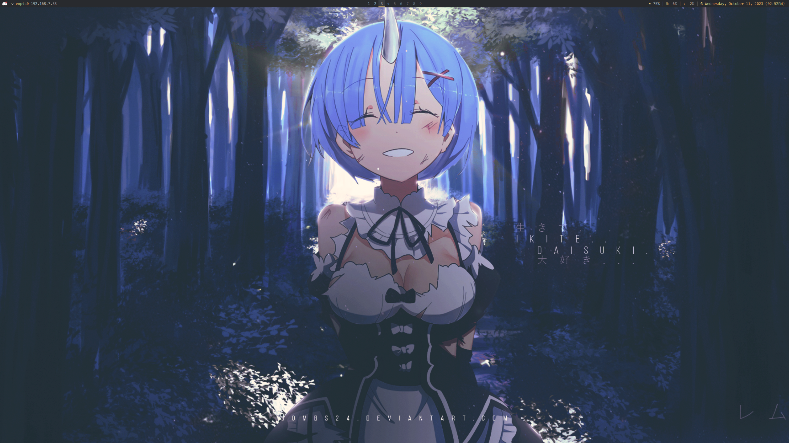

# dotfiles
Feels like ~/ to me

## Programs used
* leftwm
* feh
* imagemagick (for `import`)
* polybar
* alacritty
* pipewire (with pipewire-pulse)
* xrandr
* firefox

## Font
[FiraCode NF](https://www.nerdfonts.com/font-downloads) and [IBM Plex Mono](https://github.com/IBM/plex)

## Here's what the rice looks like!

[source](https://steamcommunity.com/sharedfiles/filedetails/?id=1184061907)
